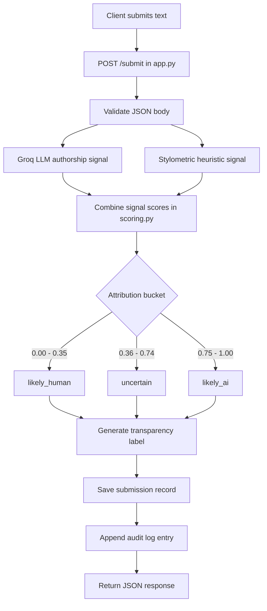
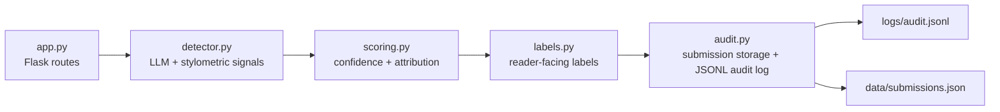
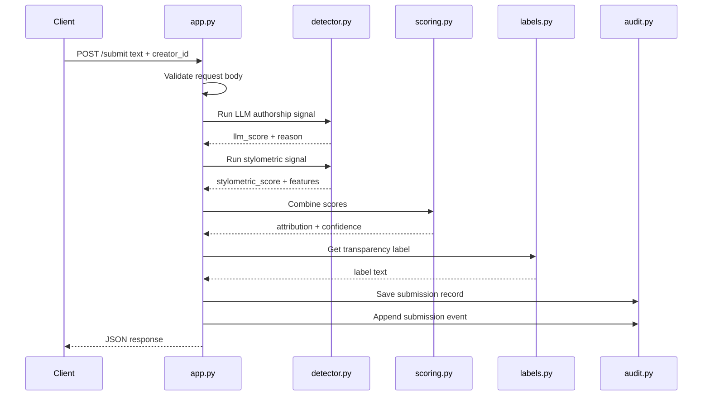
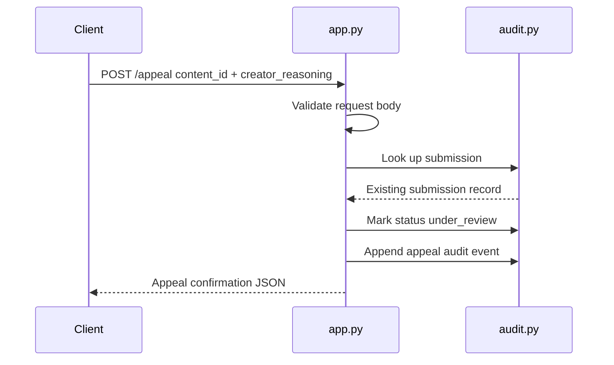

# Provenance Guard Architecture

This document is the visual architecture reference for the project. The ASCII flow in `planning.md` is the planning baseline; these Mermaid diagrams are the maintained dev-history view of how the system is wired.

## System Flowchart

Submission path from client request to JSON response:

## Component Responsibilities

Module boundaries and persistence targets:

## Submit Sequence

Request/response behavior for `POST /submit`:

## Appeal Sequence

Request/response behavior for `POST /appeal`:

## Design Notes

- **Confidence score** is an AI-likelihood score (higher = more likely AI-generated), not a certainty claim.
- **False-positive bias:** the uncertain band (`0.36`–`0.74`) is intentionally wide so borderline human writing is not over-flagged.
- **Rate limiting** applies only to `POST /submit` (`10 per minute; 100 per day`).
- **Appeals** do not trigger automatic re-classification; they update status and append a second audit event.
